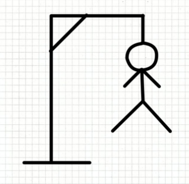

# Hangman-word-game
 

It is a program written in Python, which presents the hangman word game.

 

## Game Usage Informations
 
The game allows the opponent to choose the word (by choosing the letter g or G), the word can be chosen by the computer (by choosing the letter r or R) or you can select only the length 
of the word if none of the two preceding letters are choosed and the computer will give you one random word.The selection of the word is done through a specific file named "words".

In the case of choosing the letter g or G.The word is selected and a table is created which contains as many dashes (-) as there are letters in the word. Every time there is a message asking for 
the next letter "Give me a letter:" If the letter is the correct, it is placed in the correct position of the empty table and also in the table with the selected letters. If the letter is wrong 
then the corresponding piece of the hangman is drawn and attempts are reduced. Total attempts are 5. Also this letter is placed in the table with the selected letters. In case you have said the letter, 
a message appears: "You've already said this letter" and your attempts are not reduced. In case you find the word in your attempts (5 in total) then a message appears which says "Congratulations! 
You've found word *** !" Where *** is the word you were looking for. And a new message appears asking if you want to play again. "Do you want to play again?" If you press "no" the game 
ends. If you press "yes" you play again.if you don't find the word in your attempts, a message appears "Sorry! You lost! The word was ***" is displayed, where *** is the word you were 
looking for. Τhe same message appears again "Do you want to play again?"

In the case of choosing the letter r or R, the computer chooses the word and follows the same procedure as before.

In that case the letter g or G or r or R is not selected, then you can simply choose the length of the word which can be from 3 to 20 letters and the computer will give you one random 
word and after that follows the same procedure again.
 
